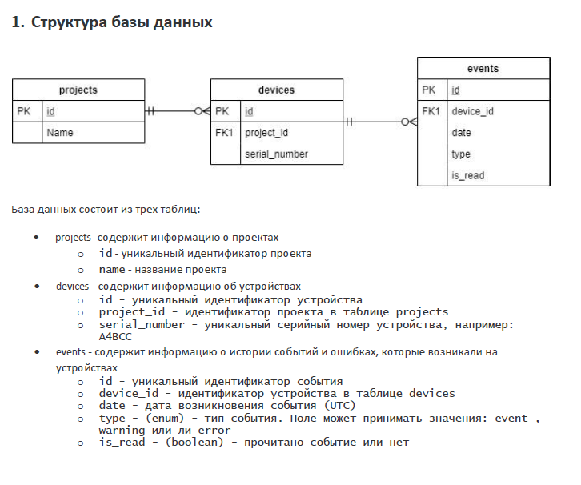
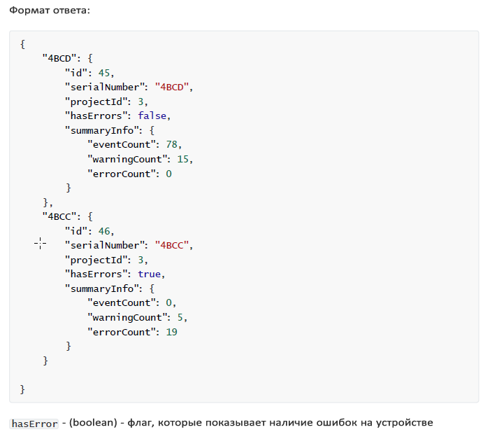
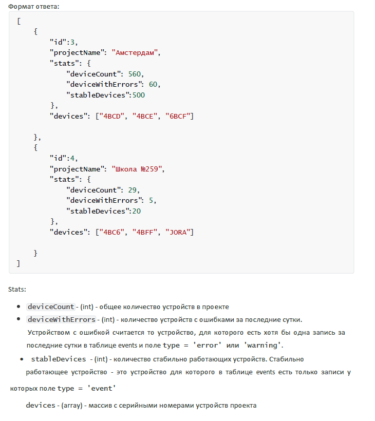

# Тестовое задание.
#### Задание:
Необходимо реализовать WEB сервер с базой данных и двумя REST запросами. Для выполнения задания можно использовать любые библиотеки и технологии.   
   
На стороне сервера необходимо реализовать REST интерфейс для получения данных о проектах и устройствах.

    1. Первый запрос должен возвращать информацию о всех устройствах проекта при передаче id проекта.   
   

Для получения необходимой информации необходимо сделать запрос GET ( http://localhost:8080/device/findDevices/{id} , где id - id необходимого проекта).

    2. Второй запрос должен возвращать информацию о всех проектах.  
   

Для получения необходимой информации необходимо сделать запрос GET ( http://localhost:8080/project/findAllProjects).        
      
Данный WEB сервис стандартный CRUD функционал:
#### Project
Get method http://localhost:8080/project/find  - предоставляет всю информацию о проектах;   
Get method http://localhost:8080/project/find/{id}  - предоставляет всю информацию о проекте с указанным id;    
POST method http://localhost:8080/project/save  - сохраняет или обновляет проект (в теле запроса необходимо передать проекта в формате JSON);   
POST method http://localhost:8080/project/delete  - удаляет проект с указанным id (в теле запроса необходимо передать id проекта в формате JSON).

#### Device
Get method http://localhost:8080/device/find  - предоставляет всю информацию о всех устройствах;   
Get method http://localhost:8080/device/find/{id}  - предоставляет всю информацию об устройстве с указанным id;    
POST method http://localhost:8080/device/save  - сохраняет или обновляет устройство (в теле запроса необходимо передать устройство в формате JSON);   
POST method http://localhost:8080/device/delete  - удаляет проект с указанным id (в теле запроса необходимо передать id устройства в формате JSON).

#### Event
Get method http://localhost:8080/event/find  - предоставляет всю информацию о всех событий;   
Get method http://localhost:8080/event/find/{id}  - предоставляет всю информацию о событие с указанным id;    
POST method http://localhost:8080/event/save  - сохраняет или обновляет устройство (в теле запроса необходимо передать событие в формате JSON);   
POST method http://localhost:8080/event/delete  - удаляет проект с указанным id (в теле запроса необходимо передать id события в формате JSON).
____

#### Инструменты:
В данном проекте использовались следующие инструменты:      
1) IntelliJ Idea    
2) Maven        
3) PostgreSQL
4) Postman 

### При реализации использовано:
* JDK 11
* Maven 3
* Spring Boot
* Spring Data
* Hibernate
* PostreSQL
* JUnit 5
* Liquibase